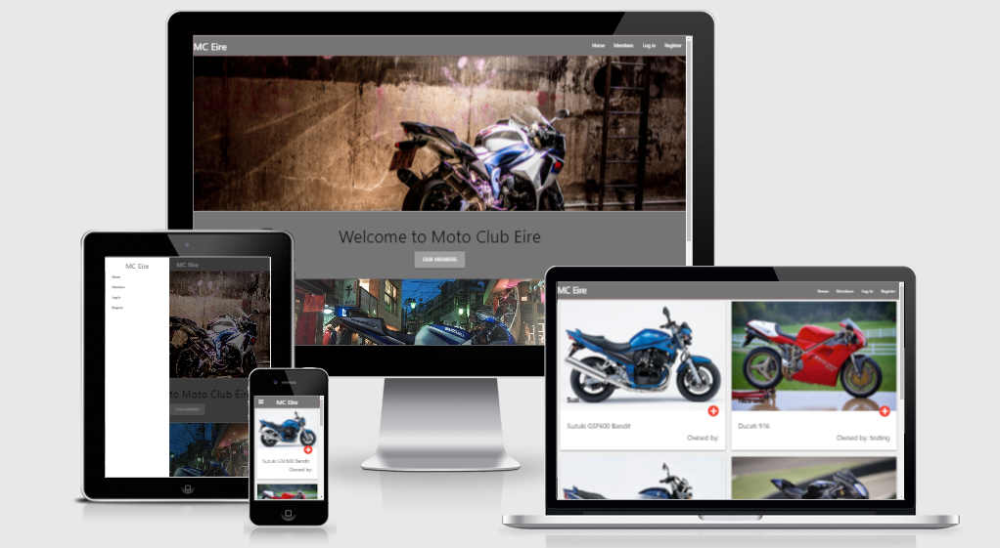

 

# Moto Club Eire

For my **Milestone Project 3** on **Code Institute's Diploma in Software Development** course I have created a motorcycle club
application. MC Eire is a new motorcycle club where users can share their bikes, gear, and the favorite routes. 

For link to the website click [Here](https://moto-club-eire.herokuapp.com/)

Application is designed for all screen sizes.

## Who is this application for?
This web application is designed for all the motorcycle enthusiasts. It showcases the 

## What does it do?
Users can share their motorcycle and also view the motorcycles of the other club members. Users can have multiple bikes added. As well as motorcycles,
application also allows users to add all of their safety gear and their favorite route. Users are also able to post comment under
each of the bikes.

## User Experience

### User Stories
1. As a user I want to be able to navigate the website clearly and logically
2. As a user I want to be able to see all the bikes in the club
3. As a user I want to be able to register in the club
4. As a user I want to add my bike and gear to my profile
5. As a user I want to be able to delete or edit bike on my profile
6. As a user I want to be able to post a comment under any bike
7. As a user I want to be able to search for the bikes in the club

### Fulfilment of user stories
1.
2.
3.
4.
5.
6.
7.

## UX 5 Planes

### Strategy Plane

Goal was to create a social website for motorcycle enthusiasts who can share their bike and gear with other enthusiasts.
Users who register are able to add their motorcycle and post comments under all the other bikes.
I also wanted to make all added motorcycle visible for everyone who is maybe thinking of joining the club, because
every motorcycle enthusiast likes to see a nice bike.

### Scope Plane
To achieve user and owner’s goals, below are the minimum features to be included in this project. Also, **CRUD** &#40;Create, Read, Update, and Delete&#41; functions are required for this project so these are implemented as a part of essential features.

* Simple design landing page with call-to-action buttons
* Members page where users can see all the motorcycles with little details
* Call-to-action buttons on each motorcycle that shows more details about that motorcycle
* Register page where users can create an account to create account
* Login page where users can log in to the website
* Logout function that users can log out the website
* Profile page where users can see all their motorcycles and buttons to edit or delete any of them
* Add bike page where users can add their bikes
* Search on a members page so users can search through all the bikes
* Comments section under each motorcycle so users can interact
* 404 page that shows for invalid URL and takes users back to *Home* page safely

### Structure Plane

#### Header and navigation
Header is the same through entire website and consists of:
* Logo which on click redirects user to the home page
* Navigation links for *Home*, *Members*, *Log In* and register for users which are not logged in
* Navigation links for logged-in users: *Home*, *Members*, *Profile*, *Add Bike* and *Log Out*

Mobile Navigation is done with Materialize sidebar which is compressed into *burger* icon

#### Landing Page

Page consists of two static images with parallax styling and two call-to-action buttons with pulsating effect.
*Our Members* button redirects users to the *Members* page and *Join The Club* button redirects user to the *Register* page.

#### Members Page

Page features all the bikes entered by the users in the style of cards. 
Each card consists of the motorcycle image, Motorcycle nickname in the bottom left corner of the image, Make and Model 
of the motorcycle and information of its owner.
Each card also contains a call-to-action button with tooltip *Click for more!* which redirects user to the full details of that Motorcycle

At the bottom of the page there is pagination for user to brows through motorcycles collection.

#### Profile Page

This page consists of the header which displays the username of the user and information about all motorcycles he added.
Each motorcycle user adds is displayed in a card style as follows:
* Image
* Nickname in the bottom left corner of the image
* If user is looking at his profile the buttons for *Edit* and *Delete* will be shown
* Motorcycle make and model on the left side and details about the gear owner is using on the right side
* information of the users favorite route in format *Start of Route*, *Route Via*, *End of Route*.
* Comments of all users displayed in rows with the name of the user who posted the comment underneath
* If user is logged in: Text input field to add a comment accompanied by the button to post the comment

If the user has more motorcycles added the next motorcycle will be shown underneath in a new card with the same formatting as above

#### Add Bike Page

This page is only visible to the users who have registered. 

It consists of the form spreading through the whole screen. The form takes text input about his motorcycle, gear and favorite route
At the bottom of the page is the **Submit button which saves all the details in the database.
Note that the use needs to provide the image of the motorcycle in URL format as instructed by the Code Institute

#### Login/ Register Pages
* *Login*
This page consists of the simple contact form asking user for his/hers username and password to log him/her in the website
  
* *Register*
This page is only visible to the users who are not logged in. Consists of simple contact form asking user to create a new account. 
  

Both pages just underneath the submit button have links for one other to help user with navigation.

#### Footer

Footer is same throughout the whole website and it consists of the text area with club name, social icons with links to their respective social media and copyright information

### Skeleton Plane

This website is designed to work on all the screens. 

Wireframes can be found [Here](#)

### Surface Plane

**Colour** 
Throughout the whole website two colors are used:
1. \#7575 Grey 
 - used for Header, Footer, and the buttons  

2. \#eeeeee Whitesmoke
 - used for the background color of the whole website

**Typography**

The font has been acquired from **Google Fonts** and tho suit the overall looks of the website 
**Tourney** font has been uset in black color with the weight of 900

## Features

### Existing Features

* Created in *HTML*, *CSS*, *Javascript*, *Python*, *Flask* and *Materialize*  
* Database used for the project is *MongoDB*
* Log In, Log Out, Edit and Delete functionality
* Members page which displays all the member's motorcycles with links to their full profiles
* Comment section so the users ca interact with each other
* Custom 404 page 
* Full user verification 

### Features for future implementation

* Organize events functionality
* Club merchandise shop
* Allowing user to upload their own images, and allowing them to upload more images for each motorcycle
* 

## Technologies used

* [HTML5](https://en.wikipedia.org/wiki/HTML) for markup
* [CSS3](https://en.wikipedia.org/wiki/CSS) for style
* [Python](https://www.python.org/) for backend development
* [Flask](https://palletsprojects.com/p/flask/) for frameworks
* [MongoDB](https://www.mongodb.com/) as the database for the website 
* [Git](https://git-scm.com/) for version control
* [GitHub](https://github.com/) as a remote repository
* [Materialize](https://materializecss.com/) for main frame of the website
* [JavaScript](https://www.javascript.com/) For functionality of some parts of website
* [PyCharm](https://www.jetbrains.com/pycharm/) As my main editor and local repository
* [Heroku](https://www.heroku.com/) For deployment of the website

## Resources

* [pixabay](https://pixabay.com/) for images with free license
* [Code Institute](https://codeinstitute.net/) course materials
* [Code Institute Slack](https://codeinstitute.net/) Slack Community
* [MDN](https://developer.mozilla.org/en-US/) general help and pointers
* [Stackoverflow](https://stackoverflow.com/) general help and pointers
* [Youtube](https://www.youtube.com/) general help and pointers
* [W3schools](https://www.w3schools.com/) general help and pointers
* [Am I Responsive](http://ami.responsivedesign.is/) for a responsive image in Read Me
* [Soda PDF](https://www.sodapdf.com/jpg-to-pdf/) to convert images to PDF
* [LogoMakr](https://logomakr.com/) for creation of the logo
* [Google](https://www.google.ie/) for image links for motorcycles and general help
* [Google Fonts](https://fonts.google.com/) for the font used throughout the website
* [Font Awesome](https://fontawesome.com/) for icons

## Testing

## Version Control

## Deployment

