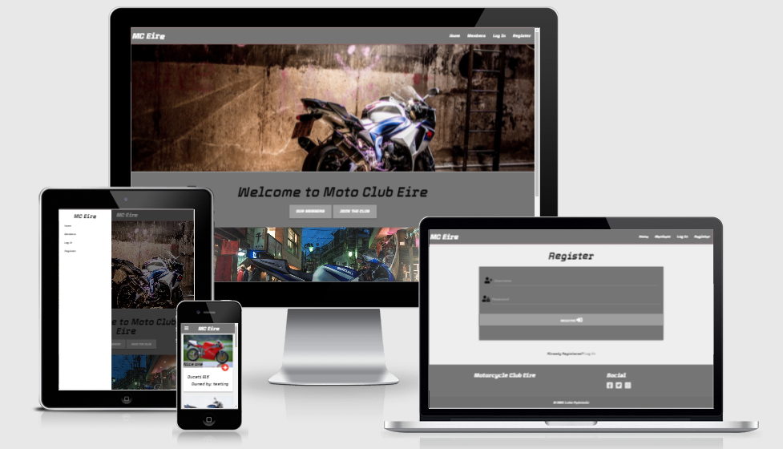

 

# Moto Club Eire

For my **Milestone Project 3** on **Code Institute's Diploma in Software Development** course I have created a motorcycle club
application. MC Eire is a new motorcycle club where users can share their bikes, gear, and the favorite routes. 

For link to the website click [Here](https://moto-club-eire.herokuapp.com/)

Application is designed for all screen sizes.

## Who is this application for?
This web application is designed for all the motorcycle enthusiasts. It showcases the 

## What does it do?
Users can share their motorcycle and also view the motorcycles of the other club members. Users can have multiple bikes added. As well as motorcycles,
application also allows users to add all of their safety gear and their favorite route. Users are also able to post comment under
each of the bikes.

## User Experience

### User Stories
1.
2.
3.
4.
5.
6.

### Fulfilment of user stories
1.
2.
3.
4.
5.
6.

## UX 5 Planes

### Strategy Plane

### Scope Plane

### Structure Plane

#### Header and navigation
#### Landing Page
#### Members Page
#### Profile Page
#### Add Bike Page
#### Login/ Register Pages
#### Footer

### Skeleton Plane

## Features

### Existing Features

### Features for future implementation

## Technologies used

## Resources

## Testing

## Version Control

## Deployment

