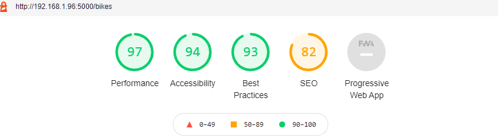
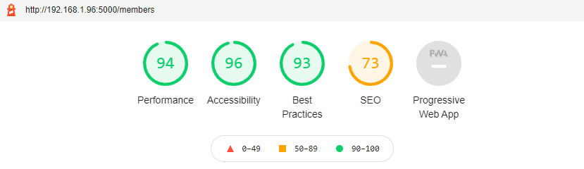
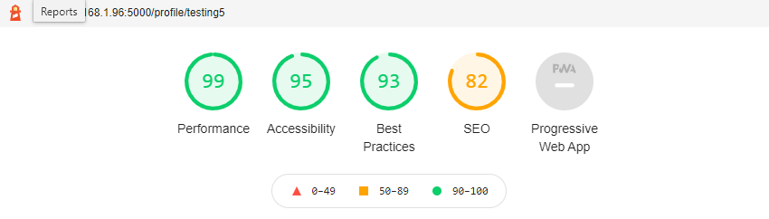
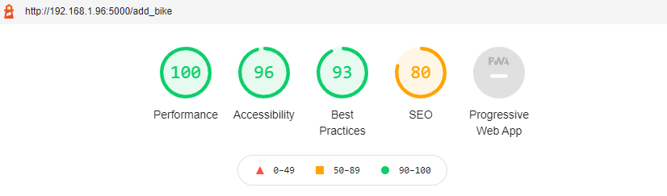
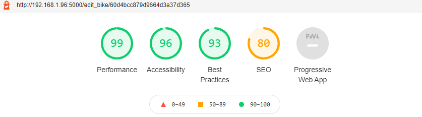

## TESTING

### User Stories

1. As a user I want to be able to navigate the website clearly and logically
2. As a user I want to be able to see all the bikes in the club
3. As a user I want to be able to register in the club, and s returning user I want to be able to log into my account
4. As a user I want to add my bike and gear to my profile
5. As a user I want to be able to see my profile and edit or delete my motorcycles
6. As a user I want to be able to search for the bikes in the club   

### Fulfilment of user stories

1. Website is designed in such a way that is easy for user to navigate from page to page. Header and Footer are the same
   throughout the whole website so user is familiar with the layout and can always get to the desired place quickly and
   easily
    - Screenshots of the fulfillment can be seen [here](readme_and_testing/img/user_strory_1.1.png) and 
      [here](readme_and_testing/img/user_story_1.2.png).

2. When a user clicks on the Members page on the navigation button or on the **See Our Members** call-to-action button
   on the landing page, user is directed to the **Members** page. Members page displays all the Bikes from the
   registered user along with the **Find Out More** button on each motorcycle. Layout of the page is made in away that
   image of the motorcycle is taking most of the user's attention with basic details about make and model of the
   motorcycle
   - Screenshots of the fulfillment can be seen [here](readme_and_testing/img/user_story_2.1.png), 
     [here](readme_and_testing/img/user_story_2.2.png) and, [here](readme_and_testing/img/user_story_2.3.png).

3. Clicking on the **Register** page in the navigation bar or on the **Join the Club** call-to-action button on landing
   page user is directed to the registration page. This page features very simple but effective form. User chooses
   his/hers username and password which will on the click on submit button create an account and direct user to his/hers
   profile. **Log In** link on the navigation bar directs user to the login page which when user fills in with his
   details logs user back in and directs him/her to the profile page.
   - Screenshots of the fulfillment can be seen [here](readme_and_testing/img/user_story_3.1.png) and 
     [here](readme_and_testing/img/user_story_3.2.png).

4. After registering user will be shown an option in the navigation bar for adding his/hers motorcycle and the 
   gear. **Add Bike** page features large contact form where user inputs all of his/hers gear and details of the 
   motorcycle followed by the favorite route.
   - Screenshots of the fulfillment can be seen [here](readme_and_testing/img/user_story_4.1.png) and 
     [here](readme_and_testing/img/user_story_4.2.png).

5. When user registers or logs in he/she is then directed to the profile page. Profile page displays all motorcycles
   that user has added. On each motorcycle there are 2 buttons one for *delete* and one for *edit* motorcycle. Delete
   button directs user to the **Delete** page where user needs to confirm the deletion of that motorcycle. **Edit**
   button directs user to prefilled form of that motorcycle where changes can be made and saved.
   - Screenshots of the fulfillment can be seen [here](readme_and_testing/img/user_story_5.1.png), 
     [here](readme_and_testing/img/user_story_5.2.png) and, [here](readme_and_testing/img/user_story_5.3.png).

6. Members page which features all the motorcycles, and their basic details also contains a search function. When user
   fills in his/hers query user will be directed to a page where all the relevant results will be displayed.
   - Screenshots of the fulfillment can be seen [here](readme_and_testing/img/user_story_6.1.png) and 
     [here](readme_and_testing/img/user_story_6.2.png).
     

### **Code Validation**

**HTML**

All the pages on the website have been put through **W3C Markup Validation Service**. There were 3 errors:

1. Footer element in the base.html template had double footer tags. The issue was fixed by removing one of the tags.

2. Duplicate id on the members page was detected. The ID in question was a custom-made padding for the card title. I
   have removed the id and placed the *sp* within the class attribute. I have then changed the style.css file by
   changing the id selector for the class selector. That fixed the issue.

3. Section Lacks heading error. Flash messages have been wrapped inside the section tag which has caused the error. I
   have changed the tags to div, and the error was fixed.

After fixing above errors I have passed every page one more time through the validation service and no errors were
detected. The screenshot of the HTML Validation can be seen [here](readme_and_testing/img/html_validation.png).

**CSS**

Code has been through **W3C CSS Validation Service** and there was one error. I cannot fix that error because it is
in  *Materialize* library. Screenshot of the error can be seen [here](readme_and_testing/img/css_validator_error.png)

**Javascript**

This project uses small portion of custom Javascript code. It is only used to initiate Materialize library. It had been
through JSHint and no errors were detected.

**Python**

The code from app.py has been passed through PEP8 Online. There were 7 lines which were too long which can be
seen [here](readme_and_testing/img/python_pep8_bad.png). Those issues were resolved by breaking the long lines into smaller ones.
Code was once again passed through PEP8 Online and no errors were detected. Screenshot of passed test can be
seen [here](readme_and_testing/img/python_pep8_good.png).

**Form Validation**

All the forms are validated with HTML. Manual testing has been carried out for the forms to confirm they are working
correctly.

1. **Register**
    - For the username and password form accepts only letters from a-z, numbers from 0-9 with a minimum length of 6
      characters and a maximum length of 15 characters. Password is case-sensitive.
    - Instructions for the users are placed underneath the form.
    - Manual testing has been carried out with multiple different combinations of usernames and passwords and form works
      as intended. Username is saved to the User collection in the database. For security reasons password is first
      encrypted by **Werkzeug** and then saved the same way.
    - If user trys to register again with the username that already exists flash message will be shown to the user that
      username is already in use

2. **Login**
    - Usernames and passwords are saved within database. Once user tys to log in the function checks if the username and
      password match. If they do user will be logged in to the website. If either username or password do not match
      flash message will display letting user know that username or password are not correct.

3. **Add Bike**
    - All the fields work as intended. Form focuses on the field properly and is validated.
    - All the fields are correctly saved to the database.
    - Manual testing of all the fields carried out.

4. **Edit Bike**
    - Same layout as the add bike form. Difference is that this form comes with the pre-populated form so the user can
      see what he/she has had there before and make desired changes
    - After submitting changes the database gets updated.
    - Manual test carried out for all the fields.

*More about the errors and fixes in later section.*

### Defensive programming

Some features of the website are not visible to the users without permission.

1. **Navigation**

- Unregistered user is unable to see the *Profile* page and *Logout* page of the navigation

2. **Profile page**

    - If a user wants to edit or delete his/hers motorcycle they can do so only when they are logged in and on their
      profile. Buttons that direct user to the *edit* and *delete* pages are available only to a logged in user looking
      at his own profile

3. **Url**

    - Trying to enter *logout*, *add bike*, *edit bike* or *delete* page manually via url gets directed to 404 page

### Browser testing

Desktop

Website performs as intended on desktop PC and on a Laptop running Windows 10 with the latest version of browser in
question.

1. Chrome

    - Everything in perfect order, no layout loss, all animations work perfectly. Forms and validations work as
      intended.

2. Opera

    - Everything in perfect order, no layout loss, all animations work perfectly. Forms and validations work as
      intended.

3. Mozilla

    - Everything in perfect order, no layout loss, all animations work perfectly. Forms and validations work as
      intended.

Mobile

1. Device / browser

    - One Plus 8T / Chrome: Layout works as intended, All the animations work perfectly. Forms are looking good and
      sidenav works perfectly.
2. Device / browser

    - Apple Iphone 12 / Safari: Layout works as intended, All the animations work perfectly. Forms are looking good and
      sidenav works perfectly.
    - Issue with google fonts loading detected and font fallback selected. More about this in the later section.

3. Device / browser

    - Apple Iphone 12 / Chrome: Layout works as intended, All the animations work perfectly. Forms are looking good and
      sidenav works perfectly.
    - Issue with google fonts loading detected and font fallback selected. More about this in the later section.

### Functionality of website

1. Responsiveness

    - Materialize library is in charge of the grid and responsiveness. By using their grid I was able to scale website
      from the smallest of screens to the large desktops. Side navigation works great and quick.

2. Links

    - All the links on the website have been manually tested and all of them are leading to the intended destinations.
      Social links currently lead to home pages of the social networks as the club pages are not set up. Tested both on
      mobile device and on PC.
3. Buttons

    - All the buttons have been tested manually. All buttons work and their actions work as intended. Tested both on
      mobile device and on PC.
4. Forms

    - All the form are working as intended and they interact well with the database. There were issues which will be
      addressed in later sections.
5. Database

    - Database performs well, all the necessary data is stored in the corresponding collections. Passwords are encrypted
      before they get saved in the database.
6. Deployment

    - Website has auto deployment from **GitHub** enabled. That means every time I push the content from my local
      repository to the remote repository new website build gets created. At the time of writing this the website was on
      version 64.

### Bugs, Errors, Issues and fixes

While performing testing I have encountered a lot of errors and issues, below are some of them:

- While dong the HTML validation 3 errors showed up:
    1. Footer had a double footer element tags. This was resolved with removing one set of footer elements.
    2. Duplicate ID. I have created a special padding for a mobile version of the card title and I have targeted it with
       an ID. I have later changed that and removed that id tag completely and instead targeted the correct div.
    3. Section lacks heading. While setting up for the project I have left the flash messages in the section tags as
       they were on the mini project. To resolve that issue I have changed section tags to div tags.

- While doing the form validation testing I have noticed that forms for adding the bike and editing it are not being
  validated properly. Forms were taking any input including the empty spaces. That issue was resolved by changing all
  the input fields from *text area* to *input field* and adding the pattern parameters to the fields. At first, I have
  added parameters to the text area field but that did not work.

- After fixing the issue above forms of *Edit bike* and *Add Bike* did not display labels correctly. That was fixed by
  adding the `type="text"` field which was missing from them.

- Label for the search bar was not displaying properly. That was resolved by wrapping input and label fields in div tag
  with `input-fiel` class as instructed on Materialize documentation.

- Value was missing on *Bike Nickname* field ond both add bike and edit bike forms. Issue was that I have forgot to
  add `{{ bike.nickname }}` to value field.

- While testing the registration form I have noticed that I could register over and over again with the same username
  and different password. After reviewing the code I have discovered that I have misspelled the function in *app.py*. I
  have written `bikes = mongo.db.bike.find({"owner": user.get("username")})` instead of `bikes = mongo.db.bikes.find({"
  owner": user.get("username")})`. **Bike** instead of **Bikes** is what was causing the issue.

- **Google Fonts** are not displaying on the Iphone and on the Ipad. I have tried to fix the issue by changing the delivery method from
  import link in CSS to link in the `head` but it did not work. I have then set up a good fallback font to minify the
  issue.

- Buttons on the *edit_bike* and *add_bike* pages did not have appropriate colour class of grey. that has been fixed.

### Quality by **Lighthouse**

Websites performance has been checked with **Lighthouse** within Chrome developer tools and results are as follows:

1. Landing Page

   
2. Members Page
   

3. Profile Page

   
4. Add Bike Page

   
5. Edit Bike Page

